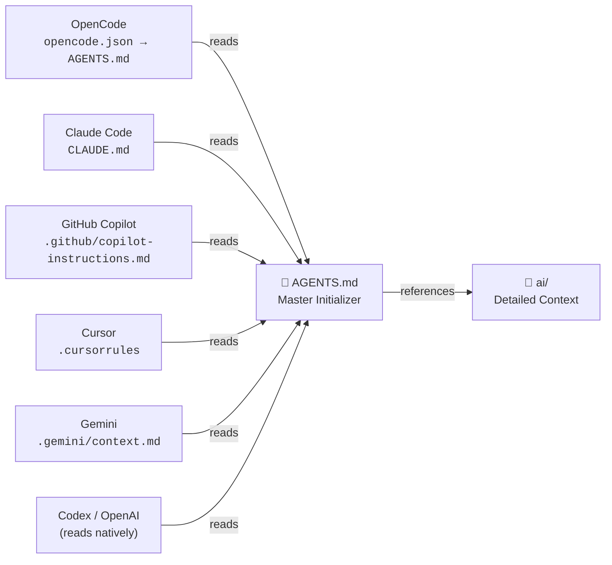

# AI Context Structure

EagleEye uses multiple AI coding tools (OpenCode, Claude Code, GitHub Copilot, Gemini, Cursor, etc.). Instead of maintaining separate context files for each tool — which would quickly diverge — all tools point to the same source.

```
📄 AGENTS.md  ← single source of truth (master initializer)
📁 ai/        ← detailed context: instructions, skills, module graph
```



## ai/ structure

```
ai/
  module-graph.md              ← module dependency graph
  instructions/
    dart.md                    ← Dart CLI patterns and conventions
  skills/
    architecture/
      SKILL.md                 ← architectural rules and code conventions
    documentation-review/
      SKILL.md                 ← docs validation
    generate-tests/
      SKILL.md                 ← test generation
    minimum-requirements/
      SKILL.md                 ← version requirements
    release-notes/
      SKILL.md                 ← release process
    review-pr/
      SKILL.md                 ← PR review checklist
    run-build/
      SKILL.md                 ← how to build and test
    testing/
      SKILL.md                 ← testing strategies
    validate-architecture/
      SKILL.md                 ← architectural validation
```

## Tool-specific config

| Location | Tool | Purpose |
|---|---|---|
| `AGENTS.md` | All tools | Master initializer — single source of truth |
| `CLAUDE.md` | Claude Code | Entry point → reads `AGENTS.md` |
| `.gemini/context.md` | Gemini | Entry point → reads `AGENTS.md` |
| `.github/copilot-instructions.md` | GitHub Copilot | Entry point → reads `AGENTS.md` |
| `.cursorrules` | Cursor | Entry point → reads `AGENTS.md` |
| `opencode.json` → `AGENTS.md` | OpenCode | Reads `AGENTS.md` and `ai/skills/` |
