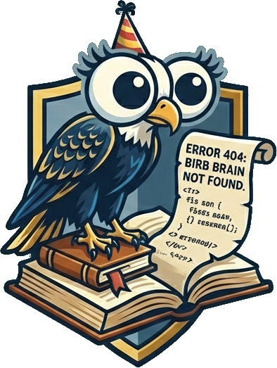

# Welcome to the Eagle Eye documentation! 👋

EagleEye is a Dart CLI tool for detecting architecture violations in Dart projects.

Take a look at our [repository](https://github.com/CodandoTV/eagle-eye).

## Summary

### 1. [Getting started](1-getting-started.md)

### 2. [Existing Rules](2-existing-rules.md)

### 3. [Contributions](3-contributions.md)

### 4. [Tooling](4-tooling.md)